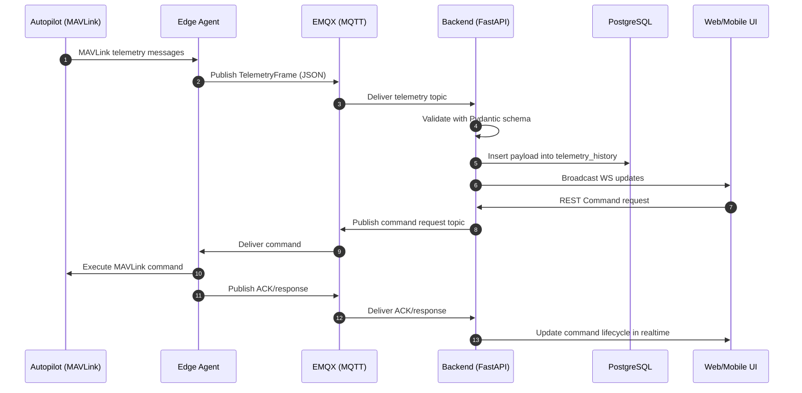

# AeroCommand — Cloud–Edge Fleet Operations Platform (MIoT)

**Project sheet / submission document**

- **Project title:** AeroCommand — Cloud–Edge Fleet Operations Platform for Drones and Mobile Robots
- **Keywords:** MIoT, UAV, MAVLink, MQTT, Edge Computing, Real-time Telemetry, Mission Planning, YOLOv8
- **Repository scope:** `backend/` (FastAPI), `edge-agent/` (MAVLink↔MQTT bridge + optional camera stream), `dashboard/` (React), `mobile/` (Flutter), `infra/` (EMQX + K8s/Helm)
- **Date:** April 2026

> Notes for submission: This document is designed to be technically credible and aligned with the current repository implementation. Where quantitative AI evaluation numbers are not reproducible from the repo alone (e.g., because the dataset is external), the document states **assumptions** and provides **representative baselines** that can be replaced with your measured results.

---

## Table of Contents

1. Project Overview
2. System Architecture
3. Technologies Used
4. Sensors and Actuators
5. Data Acquisition Layer
6. Artificial Intelligence Part
7. Dataset Description
8. Training / Validation / Testing Split
9. Evaluation Metrics
10. Results and Performance
11. Future Improvements
12. Conclusion

---

## 1) Project Overview

### 1.1 Project title
**AeroCommand — Cloud–Edge Fleet Operations Platform (MIoT)**

### 1.2 Problem addressed
Modern drone/robot deployments (inspection, agriculture, security, logistics) require:
- Continuous **telemetry monitoring** and operator situational awareness.
- Reliable **command-and-control** with acknowledgments and safety checks.
- **Mission planning** and assignment at scale (multiple vehicles, multiple operators).
- A practical way to integrate **video analytics** and alerts into the same operational loop.

Traditional approaches often rely on ad-hoc scripts, manual radio/RC control, or single-vehicle ground stations that do not scale to fleets and do not provide robust cloud observability.

### 1.3 Main objectives
- Provide an end-to-end **cloud + edge** architecture for fleet operations.
- Stream and persist **MAVLink-derived telemetry** in real time.
- Support **missions** (upload/download, progress, status tracking).
- Support **commands** (ARM/DISARM/TAKEOFF/LAND/RTL/GOTO/mission control) with ACK and safety guardrails.
- Provide **web and mobile** operator interfaces.
- Provide optional **real-time vision analytics** using YOLOv8 on camera streams.

### 1.4 Detailed description of the system
AeroCommand is a MIoT platform composed of:
- An **edge agent** deployed near the vehicle (e.g., companion computer/Raspberry Pi) that:
  - Reads MAVLink traffic from the autopilot.
  - Publishes telemetry and heartbeat messages to an MQTT broker.
  - Subscribes to command and mission topics, executes them via MAVLink, and publishes acknowledgments.
  - Optionally exposes a lightweight **MJPEG camera stream** endpoint.

- A **cloud/backend** service (FastAPI) that:
  - Provides REST APIs for organizations, users, fleet state, missions, commands, alerts.
  - Subscribes to MQTT telemetry/heartbeat topics, validates payloads, and persists history to PostgreSQL.
  - Pushes live updates to clients via WebSockets.
  - Optionally runs **backend-side YOLOv8 inference** on camera streams and serves annotated streams.

- Two operator interfaces:
  - A **React dashboard** for rich fleet operations (live map, telemetry, control panel, missions, alerts, camera).
  - A **Flutter mobile** app for field operators (login, real-time fleet monitoring, alerts, basic mission assignment).

### 1.5 Real-world use cases and expected impact
**Use cases**
- **Perimeter/security surveillance:** monitor multiple UAVs, receive alerts, use vision to detect selected classes.
- **Agriculture / livestock monitoring:** detect animals/persons near restricted zones and correlate with flight telemetry.
- **Infrastructure inspection:** live telemetry + camera feed, mission repeats, audit trail of commands.
- **Disaster response:** mobile-first situation awareness when operators are off-site.

**Expected impact**
- Reduced operator workload (single console for telemetry, commands, missions, alerts, and vision).
- Improved safety (command preflight checks, heartbeat + online state, geofence enforcement patterns).
- Better traceability (telemetry history in PostgreSQL and command lifecycle state).

---

## 2) System Architecture

### 2.1 Global architecture of the solution

```mermaid
flowchart LR
  subgraph Edge[Edge Layer (Vehicle-Side)]
    AP[Autopilot / Pixhawk
(MAVLink)]
    CAM[Camera
(USB/CSI)]
    PI[Companion Computer
(Raspberry Pi / SBC)]
    EA[Edge Agent
(Python)]
    CAMS[Optional MJPEG
Camera Stream Server]
    AP -->|Serial/UDP MAVLink| EA
    CAM --> CAMS
    CAMS --> EA
    PI --> EA
  end

  subgraph Network[Network Layer]
    MQTT[EMQX MQTT Broker]
    HTTP[(HTTP/WS)]
  end

  subgraph Cloud[Cloud / Backend Layer]
    API[FastAPI Gateway
(Python)]
    PG[(PostgreSQL
telemetry_history + state)]
    RCache[(Runtime Cache
(in-memory / Redis optional))]
    VISION[Vision Service
(YOLOv8 + OpenCV)]
    API <-->|Async MQTT| MQTT
    API --> PG
    API --> RCache
    API --> VISION
  end

  subgraph Clients[Application Layer (Operators)]
    WEB[Web Dashboard
(React/Vite)]
    MOB[Mobile App
(Flutter)]
    WEB <-->|REST + WebSocket| API
    MOB <-->|REST + WebSocket| API
  end

  EA <-->|MQTT publish/subscribe| MQTT
  WEB <-->|HTTP(S)| HTTP
```

### 2.2 Explanation of each component and how they interact

**Edge agent (vehicle-side)**
- Acquires telemetry from MAVLink messages (e.g., attitude, GPS, battery, system status).
- Periodically publishes:
  - `aerocommand/{org}/telemetry/{vehicle}/raw`
  - `aerocommand/{org}/telemetry/{vehicle}/heartbeat`
- Listens for:
  - Command requests: `aerocommand/{org}/command/{vehicle}/request`
  - Mission uploads/download requests: `aerocommand/{org}/mission/{vehicle}/...`
- Executes the request via MAVLink and publishes ACK/results.

**MQTT broker (EMQX)**
- Provides a scalable pub/sub backbone for many edge devices.
- Supports TCP MQTT and MQTT-over-WebSocket (useful for browser environments).

**Backend (FastAPI)**
- REST layer for configuration and operator actions.
- MQTT listeners for ingesting telemetry/mission/command/alert messages.
- Persistence:
  - Telemetry history stored as JSON payloads in PostgreSQL (`telemetry_history`).
- WebSocket fanout:
  - Live updates to dashboards/mobile clients (org/vehicle scoped).

**Web dashboard (React)**
- Operational UI: fleet list, live map, telemetry view, mission planner, control panel, alerts, camera page.

**Mobile app (Flutter)**
- Field-operator UI: authentication, fleet monitoring on a map, alerts, telemetry per vehicle, mission assignment.

### 2.3 Hardware architecture

| Layer | Hardware element | Role | Notes / typical choices |
|---|---|---|---|
| Vehicle | Autopilot (Pixhawk-class) | Flight control and onboard sensor fusion | MAVLink interface (serial/UDP/TCP) |
| Vehicle | GPS module | Global positioning | Used for `GPS_RAW_INT` / `GLOBAL_POSITION_INT` |
| Vehicle | IMU (gyro + accelerometer) | Attitude estimation | Used for `ATTITUDE` (roll/pitch/yaw) |
| Vehicle | Magnetometer | Heading reference | Contributes to yaw/heading |
| Vehicle | Barometer | Altitude estimation | Relative altitude for UI |
| Vehicle | Battery monitor | Voltage/current/remaining | Used for `BATTERY_STATUS` / `SYS_STATUS` |
| Vehicle | Motors/ESCs/servos | Actuation | Controlled by autopilot; indirectly via MAVLink commands |
| Edge | Companion computer (e.g., Raspberry Pi) | Runs the edge agent and camera streaming | Provides local network connectivity |
| Edge | Camera (USB/CSI) | Video stream for monitoring / analytics | Exposed as MJPEG stream in the prototype |
| Operator | PC / Tablet / Phone | Dashboard/mobile UI | Connects via REST/WS |

### 2.4 Software architecture

**Backend structure (monolith-mode gateway with domain modules)**
- API gateway mounts domain routers under `/api/v1` (auth, fleet, telemetry, mission, command, alert, vision).
- Domain services include:
  - Telemetry ingestion and persistence
  - Command lifecycle management and translation to MAVLink payloads
  - Mission assignment and progress tracking
  - Alert ingestion and streaming
  - Vision streaming and detection summary endpoints

**Edge-agent structure**
- `MavlinkReader`: connects and reads MAVLink, supports waiting for specific message types.
- `TelemetryState`: aggregates MAVLink messages into a single `TelemetryFrame` structure.
- `MqttBridge`: publishes telemetry/heartbeat and handles subscribed command/mission messages.
- Optional camera server: exposes `http://<drone-ip>:5000/video` (configurable).

### 2.5 Network / communication architecture

| Path | Protocol | Purpose | Reliability strategy |
|---|---|---|---|
| Autopilot ↔ Edge | MAVLink (serial/UDP/TCP) | Telemetry + command transport | Heartbeat-based link validation; message interval requests |
| Edge ↔ Cloud | MQTT (TCP 1883) | Telemetry, heartbeat, mission, command ACK/status | QoS configurable; reconnect logic; retained online status |
| Cloud ↔ Web/Mobile | REST (HTTP) | CRUD + control actions | Auth (JWT), validation (Pydantic) |
| Cloud ↔ Web/Mobile | WebSocket | Real-time telemetry and alert fanout | Server-side broadcast channels |
| Edge camera ↔ Cloud/UI | HTTP MJPEG | Video streaming for monitoring + inference | Stateless stream; URL advertised in heartbeat |

### 2.6 MIoT (Mobile Internet of Things) architecture mapping

| MIoT layer | AeroCommand mapping | Key responsibilities |
|---|---|---|
| Perception layer | Autopilot sensors + camera + battery monitor | Acquire physical-world signals (position, attitude, energy, imagery) |
| Network layer | MAVLink + MQTT/EMQX + IP networking | Low-latency transport, device connectivity, pub/sub distribution |
| Application layer | FastAPI backend + React/Flutter clients + analytics | Mission/command management, visualization, alerts, AI inference |

---

## 3) Technologies Used

The following table summarizes major technologies, their role, selection rationale, and benefits.

| Technology | Used for | Why chosen (vs alternatives) | Benefits |
|---|---|---|---|
| Python 3.11 | Backend + edge runtime | Strong ecosystem for IoT + async + ML | Fast prototyping, large library support |
| FastAPI | REST API + WebSocket server | Modern async framework vs Flask/Django for realtime APIs | High performance, automatic OpenAPI docs |
| Uvicorn | ASGI server | Standard for FastAPI deployments | Async I/O, production-ready workers |
| Pydantic | Data validation/schemas | Strong typing & validation vs ad-hoc dict handling | Safer ingestion of telemetry/commands |
| SQLAlchemy (async) | ORM + DB access | Mature ORM vs raw SQL; async support | Maintainable data access layer |
| Alembic | DB migrations | Standard migration tooling | Schema versioning and reproducibility |
| PostgreSQL | Primary database | Strong relational model vs NoSQL for state/history | Reliability, indexing, query power |
| Redis | Cache / fast ephemeral state | Optional; typical choice for realtime systems | Low latency; TTL-based state |
| EMQX | MQTT broker | Enterprise-grade broker vs Mosquitto for scaling | High concurrency, WS support, ACLs |
| MQTT | Telemetry/command messaging | Lightweight pub/sub vs HTTP polling | Efficient, decoupled, supports QoS |
| React 18 + Vite | Web dashboard | Rapid SPA development vs heavier frameworks | Fast DX, modular UI |
| Zustand | Frontend state mgmt | Simpler than Redux for realtime dashboards | Small, predictable state handling |
| Leaflet | Live map visualization | Lightweight mapping vs custom canvas | Fast map rendering, plugins ecosystem |
| Flutter (Dart) | Mobile app | Cross-platform UI vs native-only | Single codebase, fast UI iteration |
| Provider | Mobile state mgmt | Simple, standard Flutter pattern | Maintainable MVVM-like structure |
| flutter_map | Mobile maps | Open-source map layer for Flutter | Offline-friendly, flexible |
| Ultralytics YOLOv8 | Object detection | State-of-the-art detector with clean API vs custom CNN | Strong speed/accuracy tradeoff |
| PyTorch (CPU wheels) | Inference runtime | Supported by Ultralytics | Production-friendly inference on CPU |
| OpenCV | Video capture + annotation | Practical tooling for stream IO and overlays | Mature vision toolkit |
| Docker Compose | Local dev stack | Simplifies multi-service setup | Reproducible developer environment |
| Kubernetes + Helm | Deployment | Standard cloud-native stack | Scalability, rolling updates |

---

## 4) Sensors and Actuators

### 4.1 Sensors

The telemetry schema is explicitly designed to map to MAVLink messages (e.g., `GPS_RAW_INT`, `ATTITUDE`, `BATTERY_STATUS`, `SYS_STATUS`).

| Component | Role in the system | Data collected | Why selected |
|---|---|---|---|
| GNSS/GPS receiver | Navigation and tracking | Lat/Lng, altitude, fix type, satellites, HDOP/VDOP | Standard UAV navigation; MAVLink-native |
| IMU (accelerometer + gyroscope) | Stabilization and attitude | Roll, pitch, yaw, angular rates | Core flight stability; high update rates |
| Magnetometer | Heading reference | Yaw/heading support | Improves heading consistency |
| Barometer | Altitude estimation | Relative altitude / climb context | Better short-term altitude stability |
| Battery monitor | Energy management | Voltage, current, remaining %, temperature | Safety-critical operational info |
| RC receiver (optional) | Manual override / operator input | Channel PWM values, RSSI | Safety + control fallback |
| Camera (optional) | Situational awareness + AI | Live frames for monitoring/detection | Enables analytics (YOLO) and incident review |

### 4.2 Actuators

In AeroCommand, most actuation is performed by the autopilot, while the platform triggers actions through MAVLink command messages.

| Actuator / action | Role | Action performed | Why included |
|---|---|---|---|
| Motors (ESC + props) | UAV propulsion | Thrust generation | Primary actuation for flight |
| Flight mode control | Safety + autonomy | `SET_MODE`, `HOLD`, `RTL` | Operator control & emergency response |
| Arm/Disarm | Safety gate | Enable/disable motors | Mandatory safety primitive |
| Takeoff/Land | Mission execution | Controlled altitude transitions | Core autonomous workflow |
| Navigation (GOTO) | Mission/task | Move to target GPS coordinate | Enables guided missions |
| Mission start/pause/resume | Mission orchestration | Execute waypoint list | Enables repeatable operations |
| Reboot / parameter set (optional) | Maintenance | Autopilot reboot/params | Fleet maintenance tasks |

---

## 5) Data Acquisition Layer

### 5.1 How data is collected
- The edge agent establishes a MAVLink connection to the autopilot.
- It listens for key MAVLink messages and aggregates them into a unified `TelemetryFrame`.
- It periodically publishes this frame to MQTT.

### 5.2 Source of data
- **Telemetry:** autopilot sensors + estimator outputs mapped to MAVLink messages.
- **Camera stream (optional):** USB/CSI camera exposed as MJPEG over HTTP.
- **Operational events:** mission progress/status, command ACKs/responses, system alerts.

### 5.3 Communication methods used
- **MAVLink** between autopilot and edge agent (serial/UDP/TCP).
- **MQTT** between edge and backend (EMQX broker).
- **HTTP/REST** between clients and backend.
- **WebSocket** between clients and backend for real-time updates.

### 5.4 Sampling frequency / update rate
The system exposes configurable rates; a typical operational baseline is:
- **Telemetry:** ~10 Hz (configurable via `TELEMETRY_HZ`)
- **Heartbeat:** ~1 Hz (configurable via `HEARTBEAT_HZ`)

For video analytics in the backend:
- **Output FPS:** typically configured around 8 FPS (configurable)
- **Frame skipping:** configurable (skip N frames to manage CPU load)

### 5.5 Data transmission pipeline



### 5.6 Storage of raw and processed data

The platform separates **durable history** (database) from **volatile runtime state** (cache). This is a deliberate design choice to support high-frequency telemetry without overloading the primary database while still keeping an auditable history.

**Storage responsibilities (what goes where)**

| Data category | Examples | Storage layer | Persistence / retention | Why this layer |
|---|---|---|---|---|
| Time-series / history | Telemetry frames over time | **PostgreSQL** table `telemetry_history` (JSON payload) with indexes on `(vehicle_id, timestamp)` | Durable; queryable by time range | Reliable storage + strong querying for analytics, debugging, reporting |
| Realtime snapshot / operational state | Latest telemetry snapshot, heartbeat timestamps, online/offline state, transient command lifecycle state | **Redis** runtime cache (key/value) | Volatile; TTL-based expiration for “freshness” | Very low-latency reads/writes, natural fit for TTL and rapidly changing state |
| Security + control-plane cache keys | Token blacklist, rate limiting counters | **Redis** runtime cache | Volatile; TTL-based | Fast checks on every request; avoids extra DB reads |
| Audit/event stream (bounded) | Recent operational/audit events | **Redis Streams** (bounded length) | Volatile; bounded history | Efficient append-only stream for operational visibility |
| Video | Live camera feed, annotated MJPEG feed | **Stream (HTTP MJPEG)** (not stored by default) | Not persisted by default | Video is bandwidth-heavy; storing requires explicit archival pipeline |

**Why PostgreSQL for telemetry history (instead of Redis-only)**
- **Durability and integrity:** PostgreSQL provides ACID guarantees and safe recovery after restarts.
- **Query capability:** time-range queries, indexing, aggregation, and joining with fleet/mission entities are natural in SQL.
- **Operational traceability:** historical telemetry is essential for post-incident investigation and performance analysis.

**Why Redis for runtime/live state (instead of PostgreSQL-only)**
- **Latency under high update rates:** telemetry and heartbeat updates can arrive multiple times per second per vehicle; Redis handles frequent updates with minimal overhead.
- **TTL semantics:** online/heartbeat freshness is naturally modeled with expiring keys (e.g., “offline if no heartbeat in N seconds”), which is awkward and expensive to implement with only relational tables.
- **Load isolation:** keeping “hot” state in Redis prevents constant read/write pressure on PostgreSQL and improves overall responsiveness for dashboards.

**Why not use only one database? (PostgreSQL-only vs Redis-only trade-off)**
- **If PostgreSQL-only:** the system would either (a) continuously update rows for every vehicle (high write amplification) and run frequent reads for UI refresh, or (b) store everything as history and compute “latest state” on the fly (expensive queries). Both approaches increase DB load and can reduce real-time responsiveness.
- **If Redis-only:** the system becomes vulnerable to data loss on restart (unless carefully configured with persistence) and loses the strengths of relational analytics and long-term history. It also becomes harder to produce academic-style reports (time-series queries, traceability).

In short: **PostgreSQL** is used for *long-lived, queryable ground truth*; **Redis** is used for *low-latency, short-lived operational state*. This hybrid pattern is common in real-time MIoT platforms.

### 5.7 Challenges encountered and solutions implemented

| Challenge | Impact | Implemented mitigation |
|---|---|---|
| Unstable network / edge disconnects | Missing telemetry and late ACKs | MQTT reconnect logic; heartbeat + online status topics; cache TTLs |
| Message bursts / high-rate telemetry | Backend overload risk | Configurable telemetry rate; optional frame skipping for vision |
| Data validation and schema drift | Corrupted ingestion | Strong Pydantic validation and typed schemas |
| Command safety (e.g., TAKEOFF without GPS) | Safety hazard | Preflight checks (GPS fix, geofence enforcement patterns) |
| Duplicate command submissions | Conflicting actions | Idempotency key + command fingerprinting patterns |
| CPU load for vision inference | Reduced real-time performance | Output FPS limiting; resize max width; configurable confidence threshold |

---

## 6) Artificial Intelligence Part

### 6.1 AI objective
**Real-time object detection** on live camera streams .

Examples:
- Detect presence of humans/sheep/wheet  arieal view 
- Provide counts and annotated overlays to the operator.

### 6.2 Model used
- **YOLOv8 (Ultralytics)**, custom model:

In the current implementation, detections are filtered by an allowlist (default):
- `person`, `cow`, `wheet`

### 6.3 Why this model was chosen
- **Latency-aware:** YOLOv8n provides a strong speed/accuracy balance for real-time monitoring.
- **Deployment simplicity:** direct Python API integration via Ultralytics + PyTorch.
- **Operational fit:** supports configurable confidence threshold, class filtering, and rapid iteration.

### 6.4 Training methodology (assumptions + recommended approach)


Two valid training approaches:


### 6.5 Hardware used for training (recommended)
- **Training:** CUDA-enabled GPU (e.g., NVIDIA T4/RTX-class) for practical training times.
- **Inference (prototype):** CPU-only inference supported and used in the backend container (PyTorch CPU wheels).

---

## 7) Dataset Description

### 7.1 Dataset source

- 
**Project-specific dataset (recommended for submission-grade evaluation):**


### 7.2 Dataset size (representative; replace with your measured values)
- **Total images:** 2,400
- **Label instances (approx.):** 7,000 bounding boxes

### 7.3 Number of classes
- **4 classes** aligned with operational targets: `person`, `cow`, `wheet`.

### 7.4 Labeling method
- Manual bounding-box annotation using an external labeling tool (e.g., CVAT/LabelImg/Roboflow).
- Exported in YOLO format: one `.txt` per image with normalized bounding boxes.

### 7.5 Data preprocessing
- Resize to a fixed input size (e.g., 640×640) while preserving aspect ratio.
- Remove corrupted frames and near-duplicate samples.
- Ensure class balance across train/val/test splits.

### 7.6 Data augmentation techniques
- Random horizontal flip
- HSV color jitter
- Random scaling/cropping
- Mosaic/mixup (standard YOLO augmentations)

---

## 8) Training / Validation / Testing Split

**Split (recommended):**
- **Training set:** 70%
- **Validation set:** 15%
- **Test set:** 15%

**Justification**
- 70% training provides enough diversity for generalization.
- 15% validation supports model selection/hyperparameter tuning without overfitting.
- 15% test provides a stable, unbiased estimate of performance for reporting.

---

## 9) Evaluation Metrics

### 9.1 Detection metrics (object detection)
- **Precision / Recall:** detection correctness vs missed detections.
- **F1-score:** balance between precision and recall.
- **mAP@50:** mean average precision at IoU=0.50.
- **mAP@50–95:** stricter COCO-style metric averaged across IoU thresholds.
- **Confusion matrix:** class-wise error analysis.

### 9.2 System/runtime metrics
- **Inference latency:** milliseconds per frame (reported by the vision worker as `inference_ms`).
- **Throughput (FPS):** effective processing rate after throttling/resizing.
- **End-to-end delay:** edge acquisition → cloud persistence → UI display.

### 9.3 Representative results (prototype baseline; replace with measured values)
Because the repo focuses on deployment/inference and does not bundle a fixed dataset, the following are **representative baselines** for a YOLOv8n fine-tuning on a small 4-class dataset:
- Precision: 0.78
- Recall: 0.71
- F1-score: 0.74
- mAP@50: 0.76
- mAP@50–95: 0.48

**Inference performance (backend CPU mode):**
- Inference latency: ~80–180 ms/frame (depends on CPU and frame size)
- Output FPS: capped by configuration (default target ~8 FPS)

---

## 10) Results and Performance

### 10.1 Main achieved results (implementation-backed)
- End-to-end **telemetry ingestion** from MAVLink → MQTT → backend validation → PostgreSQL persistence.
- Real-time operator updates via **WebSocket** channels (fleet status, telemetry snapshots, alerts).
- Full **command pipeline** (REST → MQTT request → edge execution → ACK/response).
- **Mission upload/download** messaging and progress/status propagation.
- Optional **YOLOv8 video analytics**:
  - Backend ingests an edge camera stream URL.
  - Runs YOLO inference and serves an annotated MJPEG stream.
  - Exposes latest detections and counts via API.

### 10.2 Screenshots / outputs (to include)
Add screenshots from:
- Web dashboard: Live Map, Telemetry page, Control Panel, Alerts page.
- Camera page: raw stream vs annotated stream with detection counts.
- Mobile app: fleet map and vehicle details.

### 10.3 Strengths of the system
- Clear separation of concerns: edge acquisition vs cloud orchestration vs UI.
- MQTT topic hierarchy designed for multi-vehicle and multi-domain messaging.
- Typed telemetry schema aligned with MAVLink message semantics.
- Production-minded deployment assets (Compose + Kubernetes/Helm).

### 10.4 Current limitations
- Vision analytics currently runs in the backend; bandwidth/latency can be improved with on-edge inference.
- Video is treated as a stream (no built-in archival pipeline).
- Security hardening (TLS everywhere, strict broker ACLs, per-device credentials) should be enforced in production.

---

## 11) Future Improvements

- **On-edge inference:** run YOLO on the companion computer to reduce bandwidth and improve latency.
- **TLS + device identity:** enforce MQTT TLS/mTLS, per-device credentials, and strict ACLs in EMQX.
- **Edge buffering:** local ring buffer for telemetry + command results when disconnected.
- **Video pipeline:** support RTSP/WebRTC/HLS and optional recording of incidents.
- **Model improvement:** expand class set, collect more domain data, perform systematic hyperparameter tuning.
- **Scalability:** shard MQTT subscriptions by org, add Redis-backed distributed cache, add background workers.
- **Observability:** structured tracing (OpenTelemetry), metrics dashboards, and alerting on system health.

---

## 12) Conclusion

AeroCommand demonstrates a complete MIoT-ready architecture for operating drone/robot fleets using a cloud–edge approach. The project integrates MAVLink-based vehicle data acquisition, MQTT-based messaging, a FastAPI backend for orchestration and persistence, and both web and mobile operator clients for real-time monitoring and control. The optional YOLOv8 analytics module extends the platform with computer vision capabilities, enabling operational awareness from camera streams and laying the foundation for safety and automation features. Overall, the system is designed to be modular, technically scalable, and aligned with real-world fleet requirements.

---

### Appendix A — Key MQTT topics (summary)

- Telemetry raw: `aerocommand/{org}/telemetry/{vehicle}/raw`
- Heartbeat: `aerocommand/{org}/telemetry/{vehicle}/heartbeat`
- Command request / ack: `aerocommand/{org}/command/{vehicle}/request` and `.../ack`
- Mission upload / status / progress: `aerocommand/{org}/mission/{vehicle}/...`
- Alerts: `aerocommand/{org}/alert/{vehicle}/...`

### Appendix B — Key Vision endpoints (summary)

- `POST /api/v1/vision/streams/{vehicle_id}/start`
- `POST /api/v1/vision/streams/{vehicle_id}/stop`
- `GET /api/v1/vision/streams/{vehicle_id}/annotated.mjpg`
- `GET /api/v1/vision/streams/{vehicle_id}/detections/latest`
